Residenti nel Comune di Torino nell'anno 2011
----------------------------

### Fonte

Sul sito dedicati agli [Opendata del Comune di Torino] (http://aperto.comune.torino.it)  sono stati pubblicati le [Età e regione di nascita dei residenti, anno 2011] (http://aperto.comune.torino.it/?q=node/287).

Il database *Residenti 2011*, ha informazioni sul numero di residenti suddivisi per sesso, età e regione di nascita, anno 2011. Esso contiene 4096 osservazioni su  4 variabili.

Ciascuna osservazione riporta:

- l'eta', 

- il sesso, 

- la regione di nascita, 

- il numero di residenti.

Le prime osservazioni del database risultano:


```
##   eta sesso regione nresidenti
## 1   0     F Abruzzo          1
## 2   1     F Abruzzo          2
## 3   2     F Abruzzo          3
## 4   3     F Abruzzo          1
## 5   3     M Abruzzo          3
## 6   4     F Abruzzo          3
```

Sono presenti  21 Regioni  (le 20 regioni + chi nato all'estero  ) e l'eta va da 0 a 108 anni.    
Ci possiamo aspettare che ciascuna Regione abbia al massimo 108 osservazioni sia per  maschi che femmine.     
Il grafico complessivo delle osservazioni per Regione ci dice che non tutte le Regioni hanno tutte le eta' e che il numero di osservazioni per sesso e' differente.

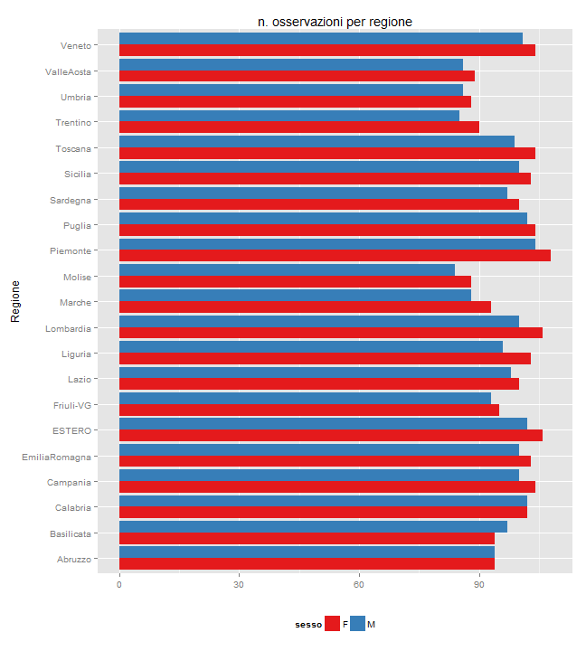 

La figura che segue dettaglia per Regione se ci sono piu' anni con femmine o maschi. In generale le femmine sono presenti su piu' anni; solo la Basilicata ha una prevalenza di maschi.


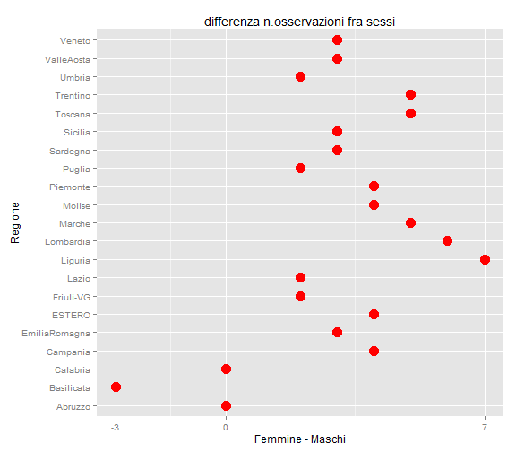 

Osserviamo ora come si ripartiscono i residenti. Partiamo dalla visione generale. I nati in Piemonte sono la maggioranza con oltre 500mila residenti.

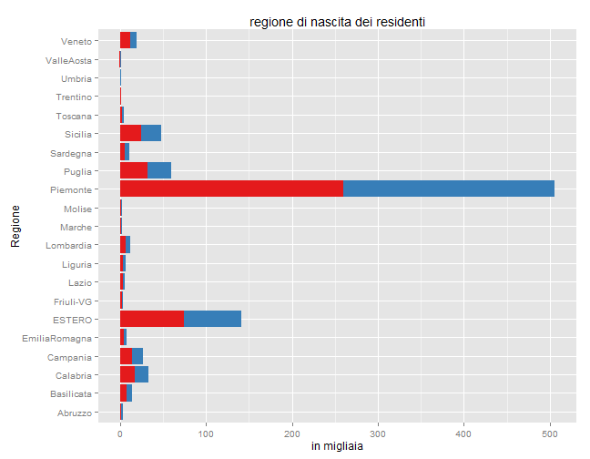 

La figura che segue, che non riporta il Piemonte, meglio permette di apprezzare le differenze fra Regioni. I residenti nati all'estero sono quasi 150mila. 

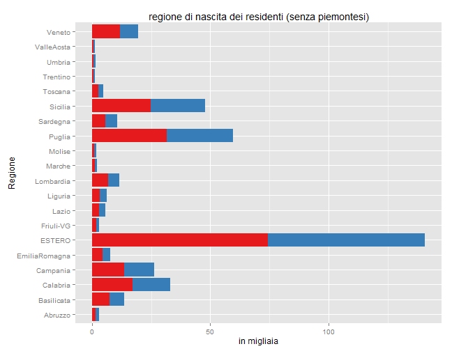 

Le figure precedenti non permettono di apprezzare le differenze fra sessi.   
La figura che segue riporta per ogni Regione la percentuale di prevalenza delle femmine sui maschi.    
Ad esempio la Regione Friuli ha oltre il 20% in piu' di femmine.


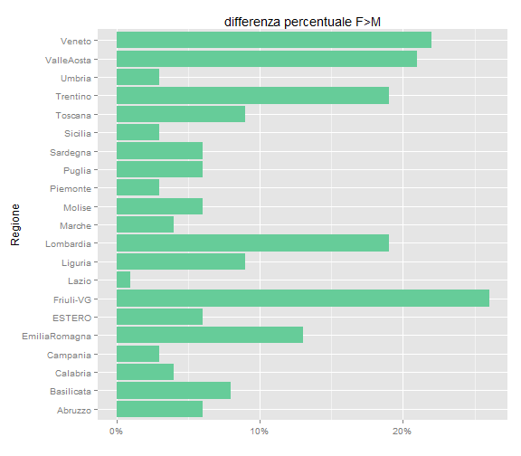 

Passiamo ora ad osservare la distribuzione dei residenti per eta e sesso in alcune regioni.

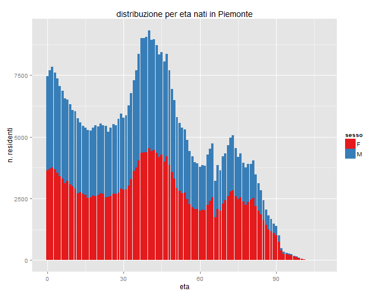 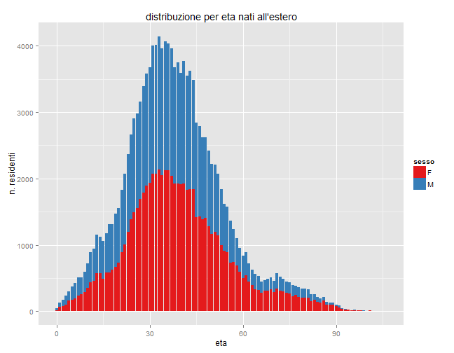 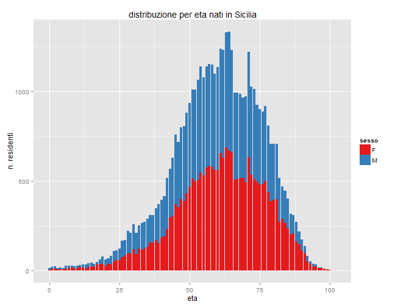 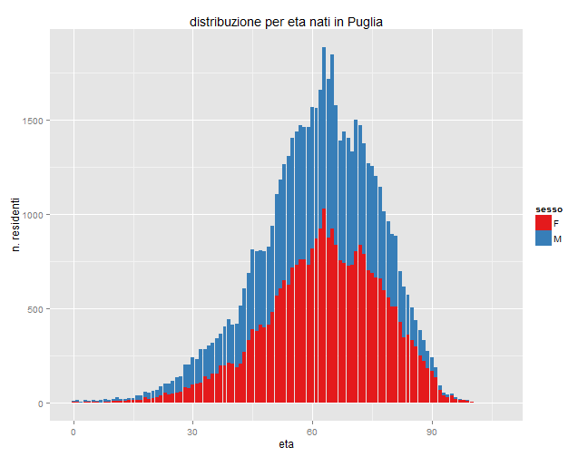 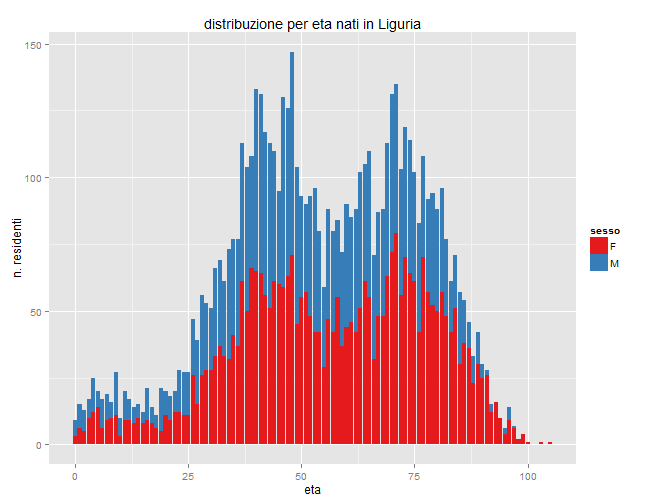 

Per ultimo prendiamo in esame le tre comunita' maggiori rispetto alla regione di nascita: i nati in Piemonte, i nati in altre regioni italiane, i nati all'estero. 

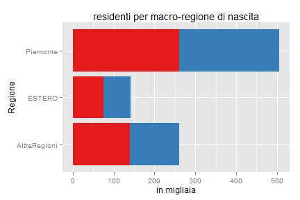 

La distribuzione delle eta' mostra una comunita' nata all'estero piu' giovane di quella che proviene dalle altre Regioni.   
Inoltre dai 50 anni in avanti la comunita' piu' grande e' quella dei nati in altre regioni dìItalia. 


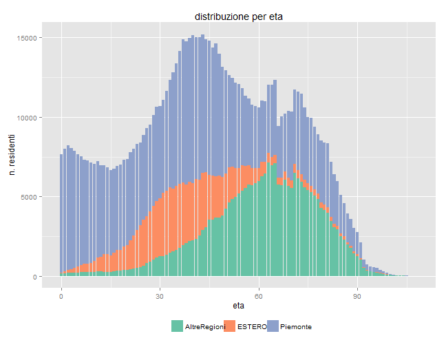 

La medesima informazione viene riportata mostrando il valore che ciascuna delle tre comunita' assume negli anni.

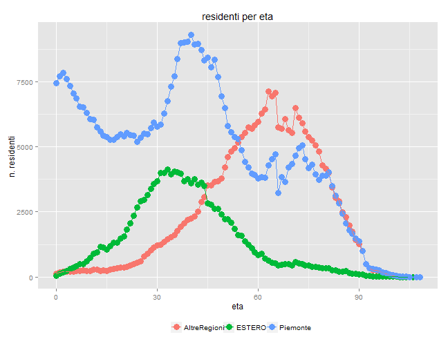 


Si e' voluto riportare un dettaglio sulla fascia di eta' fra 60 ed 80 anni.   
All'eta' di 66 anni pare esistervi un calo di residenti. 


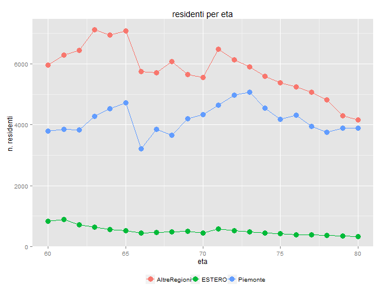 


